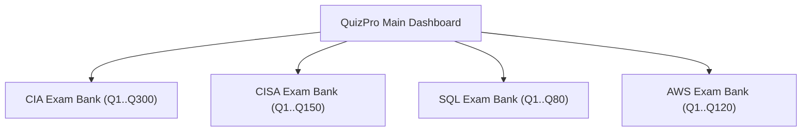

# 🎓 QuizPro — Multi-Exam Platform Documentation & User Guide

Welcome to the comprehensive documentation for **QuizPro** (formerly CSV to MCQ App). This guide covers everything from prerequisites and running the app across platforms, to the CSV formatting specifications, architecture, question model, and screen workflows.

---

## 📑 Table of Contents

1. [Quick Start: How to Run the App](#1-quick-start-how-to-run-the-app)
2. [Design System & Theme Tokens](#2-design-system--theme-tokens)
3. [Architecture & Project Structure](#3-architecture--project-structure)
4. [CSV & Excel Import Specifications](#4-csv--excel-import-specifications)
5. [Multi-Exam System & Sequential IDs](#5-multi-exam-system--sequential-ids)
6. [Practice Mode vs Exam Mode](#6-practice-mode-vs-exam-mode)
7. [Screen-by-Screen User Guide](#7-screen-by-screen-user-guide)
8. [Running Tests & Quality Assurance](#8-running-tests--quality-assurance)
9. [Troubleshooting & FAQ](#9-troubleshooting--faq)

---

## 1. Quick Start: How to Run the App

### Prerequisites
- **Flutter SDK**: 3.19.0 or later ([Download Flutter](https://flutter.dev/docs/get-started/install))
- **Dart SDK**: 3.3.0 or later (bundled with Flutter)
- **Xcode** (for macOS & iOS builds on Apple Silicon/Intel Macs)
- **Android Studio / Android SDK** (for Android Emulator/Devices)
- **Google Chrome** (for Web preview)

### Step 1: Clone or Navigate to the Workspace
```bash
cd "/Users/aryanyadav/Desktop/PROJECTS/1 - MCQ-App"
```

### Step 2: Install Dependencies
```bash
flutter pub get
```

### Step 3: Check Available Devices
```bash
flutter devices
```

### Step 4: Run on Your Preferred Platform

#### 🍎 Run on macOS Desktop (Recommended for development)
```bash
flutter run -d macos
```

#### 🌐 Run in Google Chrome (Web App)
```bash
flutter run -d chrome
```

#### 📱 Run on iOS Simulator
```bash
open -a Simulator
flutter run -d ios
```

#### 🤖 Run on Android Emulator / Connected Device
```bash
flutter run -d android
```

#### 🚀 Build Release Bundle
```bash
# macOS Desktop App
flutter build macos --release

# Web Production Bundle
flutter build web --release

# Android APK
flutter build apk --release
```

---

## 2. Design System & Theme Tokens

QuizPro is built with a SaaS-grade visual design language defined in [`lib/theme/app_theme.dart`](lib/theme/app_theme.dart):

| Token | Hex Value | Purpose |
|---|---|---|
| **Background** | `#F8F9FB` | Soft, calm off-white page background |
| **Surface** | `#FFFFFF` | Card backgrounds, top navbar, modals |
| **Primary Navy** | `#1E3A5F` | Primary brand color, headers, buttons |
| **Accent Blue** | `#2563EB` | Interactive highlights, progress bars |
| **Text Primary** | `#0F1117` | High contrast body & question typography |
| **Secondary Text**| `#6B7280` | Subtitles, helper text, neutral metadata |
| **Border** | `#E5E8ED` | Subtle dividing lines, card borders |
| **Success** | `#16A34A` | Correct answers, passed badges, stats |
| **Danger** | `#DC2626` | Incorrect answers, leave confirmations |
| **Warning** | `#D97706` | Unanswered questions, flagged tags |

- **Corner Radii:** 10px (buttons, inputs, chips) to 14–16px (cards, modals).
- **Typography:** DM Sans / Inter style clean typography with tabular mono figures (`FontFeature.tabularFigures()`) for timers and question counters.

---

## 3. Architecture & Project Structure

```text
lib/
 ├── main.dart                          # App bootstrap, theme notifier, initial route
 ├── theme/
 │    └── app_theme.dart                # Design system tokens and ThemeData
 ├── models/
 │    ├── exam.dart                     # Exam model, sequential ID reindexing
 │    ├── question.dart                 # Single/Multiple select, 4 option explanations
 │    └── performance.dart              # ExamPerformance history & analytics model
 ├── services/
 │    ├── import_service.dart           # Robust CSV parser, validation & duplicate checker
 │    └── storage_service.dart          # Local JSON storage, multi-exam CRUD, autosave
 └── screens/
      ├── home_screen.dart              # SaaS Dashboard, top nav, KPI cards, exam list
      ├── question_bank_screen.dart     # Dedicated Question Bank with filters & editor
      ├── take_exam_screen.dart         # Session setup (Mode, Q-count, Duration, Summary)
      ├── practice_mode_screen.dart     # Practice mode with Show Answer & option explanations
      ├── exam_screen.dart              # Exam mode with locked answers, timer & autosave
      ├── import_preview_screen.dart    # 4-Step import validation & ID preview
      ├── result_screen.dart            # Results (Summary & Review Answers tabs)
      └── settings_screen.dart          # Theme toggle, sound & haptic settings
```

---

## 4. CSV & Excel Import Specifications

QuizPro supports flexible CSV imports. **Question IDs are never required in the CSV file** — the application generates sequential IDs (`Q1..QN`) automatically.

### Recommended Multi-Option CSV Format

```csv
question_text,question_type,option_a,option_b,option_c,option_d,correct_answer,explanation_a,explanation_b,explanation_c,explanation_d,topic,difficulty
"Which statement retrieves data from a database?",single,INSERT,SELECT,UPDATE,DELETE,B,"INSERT adds rows.","SELECT queries existing data.","UPDATE modifies rows.","DELETE removes rows.",SQL,2
"Which of the following are cloud providers?",multiple,AWS,Linux,Google Cloud,Azure,A|C|D,"AWS is Amazon's cloud.","Linux is an operating system.","Google Cloud is GCP.","Azure is Microsoft's cloud.",Cloud,3
```

### Supported Column Names (Case-Insensitive)

| Feature | Primary Header Name | Alternative Supported Headers |
|---|---|---|
| **Question Text** | `question_text` | `question`, `question text`, `q` |
| **Question Type** | `question_type` | `type` (`single` or `multiple`) |
| **Option A** | `option_a` | `option 1`, `option1`, `a` |
| **Option B** | `option_b` | `option 2`, `option2`, `b` |
| **Option C** | `option_c` | `option 3`, `option3`, `c` |
| **Option D** | `option_d` | `option 4`, `option4`, `d` |
| **Correct Answer**| `correct_answer`| `correct`, `answer`, `ans` |
| **Explanations** | `explanation_a`..`d`| `exp_a`..`d`, `explanation a`..`d` |
| **Topic** | `topic` | `category`, `subject` |
| **Difficulty** | `difficulty` | `level` (1=Easy to 5=Hard) |

### Correct Answer Notation Rules
1. **Single Select:**
   - Letters: `A`, `B`, `C`, or `D` (or lowercase `a`, `b`, `c`, `d`).
   - Indices: `1`, `2`, `3`, or `4` (or `0`, `1`, `2`, `3`).
   - Option Text: The exact string text of the matching option.
2. **Multiple Select:**
   - Separated with pipe or comma: `A|C`, `A,C`, `1|3`, `A|B|D`.

---

## 5. Multi-Exam System & Sequential IDs

Each Exam (e.g. **CIA**, **CISA**, **SQL**, **AWS**) is completely isolated:



### How Question IDs Accumulate:
1. **CIA** begins with 0 questions.
2. Import `Batch_1.csv` (50 questions) $\rightarrow$ Assigned **`Q1` – `Q50`**. Total = **50**.
3. Import `Batch_2.csv` (100 questions) $\rightarrow$ Assigned **`Q51` – `Q150`**. Total = **150**.
4. Import `Batch_3.csv` (150 questions) $\rightarrow$ Assigned **`Q151` – `Q300`**. Total = **300**.
5. Import `Security.csv` (50 questions) into **CISA** instead $\rightarrow$ CISA independently starts at **`Q1` – `Q50`**.

---

## 6. Practice Mode vs Exam Mode

| Feature | 📘 Practice Mode | ⏱️ Exam Mode |
|---|---|---|
| **Primary Goal** | Learning & instant comprehension | Simulation of realistic exam conditions |
| **Answer Reveal** | User clicks **Show Answer** on demand | **Locked 🔒** with tooltip until exam submission |
| **Explanations** | Shows all 4 option explanations individually with ✅ / ❌ status | Only visible after exam submission in Results |
| **Navigator States** | Current, Answered, Unanswered, Correct, Incorrect | Current, Answered, Unanswered, Flagged |
| **Autosave** | In-memory session state | Autosaved to local disk every 5s & lifecycle pause |
| **Time Out** | Optional timer reminder | Automatic submission dialog when time reaches `00:00` |
| **Analytics Impact**| Separate mistake drill | Saved to exam performance history |

---

## 7. Screen-by-Screen User Guide

### 1. Main Dashboard (`home_screen.dart`)
- **Top SaaS Navigation Bar:** `QuizPro` logo, quick links (`Dashboard`, `Exams`, `Question Bank`, `Import Questions`, `Settings`), user profile avatar.
- **Greeting & KPIs:** Personalized greeting, Total Questions Answered, Average Score, Total Study Time.
- **Exam Cards:** Grid of exam cards (e.g., CIA, CISA, SQL) showing question count, progress bar, and **Practice** / **Start Exam** actions.

### 2. Session Configuration (`take_exam_screen.dart`)
- **Exam Picker:** Choose target exam with question count preview.
- **Mode Selector:** Choose between **Practice Mode** and **Exam Mode**.
- **Question Count Chips:** `10`, `20`, `30`, `50`, or `Custom`.
- **Duration Chips:** `15 min`, `30 min`, `45 min`, `60 min`, or `Custom`.
- **Dynamic Summary:** Live summary e.g. `CIA · Practice · 20 Questions · 30 Minutes`.
- **Action Button:** `Start Practice` or `Start Exam`.

### 3. Question Bank (`question_bank_screen.dart`)
- **Exam Filter:** Switch between exams to view isolated banks.
- **Search & Filters:** Search question text, filter by Question Type (Single/Multiple), Topic, or Difficulty.
- **Actions:** View question modal, Edit question, Delete question, and **+ Add Question** modal.

### 4. CSV Import Flow (`import_preview_screen.dart`)
- **Step 1:** Select target exam.
- **Step 2:** Choose CSV/XLSX file.
- **Step 3:** Review Validation Preview (Total rows, valid count, warnings, duplicate detection, and exact Q-ID range `Q151..Q200`).
- **Step 4:** Confirm Import $\rightarrow$ **Import Complete** success banner with new totals.

### 5. Results & Review (`result_screen.dart`)
- **Summary Tab:**
  - Hero card with large score percentage (`80%`, `16 / 20`) and PASSED/NEEDS IMPROVEMENT badge.
  - Stat counters: Correct (Green), Incorrect (Red), Unanswered (Orange), Time Used (Blue).
  - Topic performance progress bars.
  - **Practice Mistakes** button to instantly launch a practice session for missed questions.
- **Review Answers Tab:**
  - Question-by-question breakdown showing your selection, correct answer, and individual option explanations.

---

## 8. Running Tests & Quality Assurance

### Run the Full Test Suite
```bash
flutter test
```
*Expected Output: `All tests passed!` (17/17 tests).*

### Run Code Linter & Static Analysis
```bash
flutter analyze
```
*Expected Output: `No issues found!`.*

---

## 9. Troubleshooting & FAQ

#### Q: How do I add a new exam (e.g., AWS Solutions Architect)?
> On the Dashboard, click **+ Add Exam**, enter "AWS Solutions Architect", and click Create. You can now import CSVs directly into it or add questions via the Question Bank.

#### Q: What happens if I accidentally close the app during an Exam?
> Your session is autosaved every 5 seconds. When you reopen the exam, the app will ask: *"Resume previous session?"* and restore your remaining time, answered questions, and current position.

#### Q: How does multiple-select question grading work?
> Multiple-select questions require an exact match. If options A and C are correct, selecting only A or selecting A, B, and C will be marked incorrect. Full credit is awarded only when the selected set is exactly `{A, C}`.

#### Q: Where is data stored?
> All exam data, questions, sessions, and performance analytics are stored locally on your device in JSON format via Flutter's `SharedPreferences` / application documents directory. No cloud server or external database is required.

---

*QuizPro — Developed with Flutter & Dart.*
