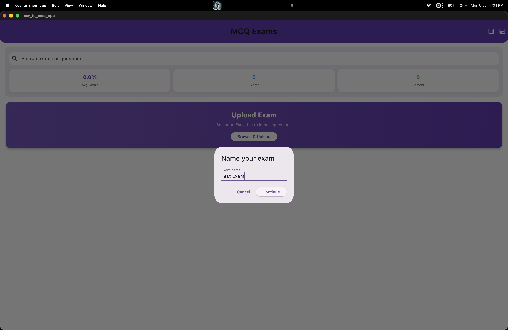
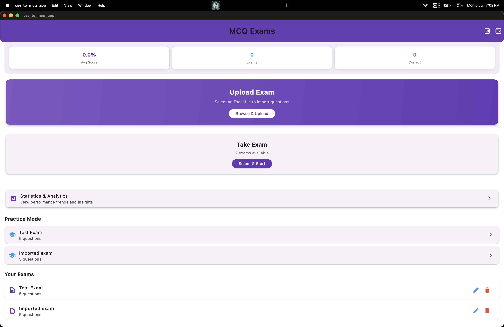
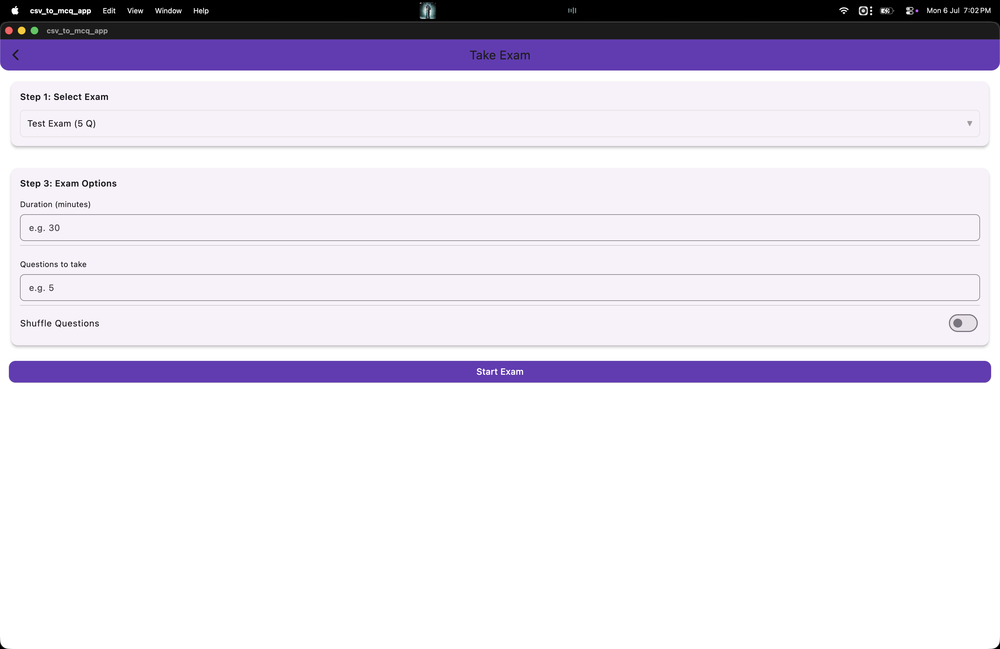

# 📝 CsvToMcqApp

A beautifully designed, cross-platform Flutter application built to seamlessly convert Excel and CSV files into interactive Multiple Choice Question (MCQ) exams. Designed with a clean and modern user interface, it provides students, teachers, and self-learners a seamless environment to import question banks, take practice tests, and track performance with advanced analytics.

---

## ✨ Features

- **📊 Smart Import:** Easily import your own question banks using `.csv` or Excel (`.xlsx`) files.
- **🖥️ Clean UI/UX:** A stunning, desktop-class user interface crafted with modern design principles.
- **📝 Interactive Exams:** Take timed or untimed exams with navigation, review marking, and instant feedback.
- **📈 Advanced Analytics:** Track your average score, total exams taken, and correct answers visually.
- **📂 Offline & Secure:** All your exams and statistics are stored locally on your device for absolute privacy.
- **🎯 Practice Mode:** Take a quick test to brush up on your skills without affecting your main statistics.
- **📱 Cross-Platform:** Optimized for desktop platforms (macOS, Windows, Linux) and Web/Mobile.

---

## 📸 Screenshots

Here is a glimpse of the application in action:

| Dashboard | Uploading an Exam |
| :---: | :---: |
|  |  |

| Naming Your Exam | Populated Dashboard |
| :---: | :---: |
|  |  |

| Taking an Exam |
| :---: |
|  |

---

## 🛠️ Data Format Guide

To import an exam, your Excel or CSV file should contain the following headers (order doesn't matter, but the names must match closely):

| Question | Option A | Option B | Option C | Option D | Correct Answer |
| :--- | :--- | :--- | :--- | :--- | :--- |
| What is the capital of France? | Berlin | Madrid | Paris | Rome | Paris |
| Which language is used in Flutter? | Java | Dart | Python | C++ | Dart |

*Note: The text in the "Correct Answer" column must exactly match the text of one of the options.*

---

## 🚀 Getting Started

### Prerequisites

- Flutter SDK (3.0.0 or later)
- Dart SDK (2.18.0 or later)

### Installation

1. **Clone the repository:**
   ```bash
   git clone https://github.com/Coderaryanyadav/CsvToMcqApp.git
   cd CsvToMcqApp
   ```

2. **Get dependencies:**
   ```bash
   flutter pub get
   ```

3. **Run the app:**
   ```bash
   flutter run -d macos  # Or windows/linux/chrome
   ```

---

## 🏗️ Project Structure

```text
lib/
 ├── main.dart               # Entry point and theme configuration
 ├── models/                 # Data classes (Exam, Question, Performance)
 ├── screens/                # UI Screens (Dashboard, Exam, Results, Stats)
 └── services/               # Core business logic (Excel/CSV parsing, Storage, Analytics)
```

## 🤝 Contributing

Contributions, issues, and feature requests are welcome! Feel free to check the [issues page](https://github.com/Coderaryanyadav/CsvToMcqApp/issues).

## 📄 License

This project is licensed under the MIT License - see the LICENSE file for details.

---
Developed with ❤️ by [Aryan Yadav](https://github.com/Coderaryanyadav)