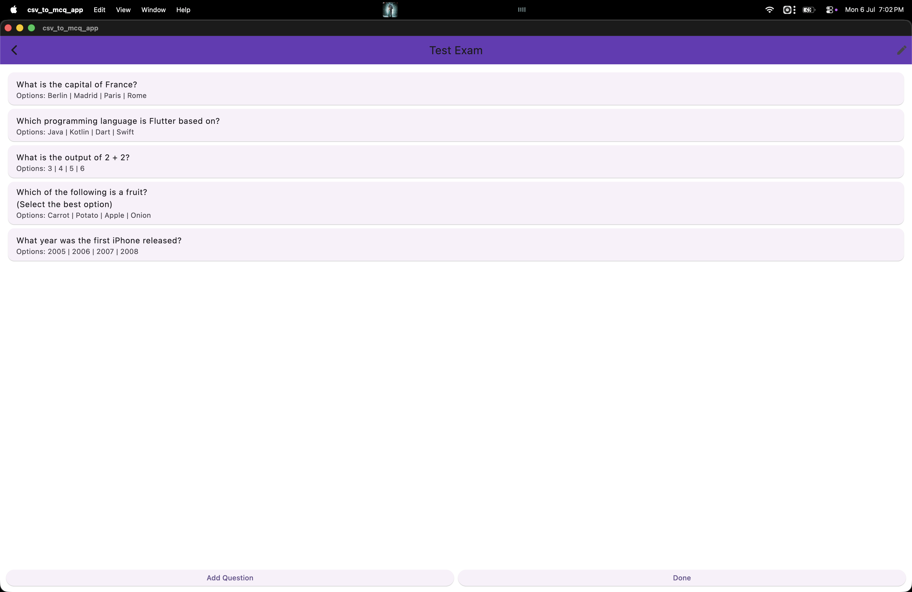
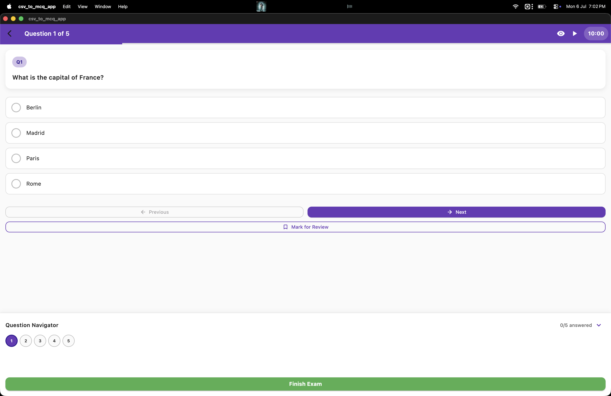

# 🎓 QuizPro — Modern MCQ & Examination Simulator

[](https://github.com/Coderaryanyadav/CsvToMcqApp/actions/workflows/flutter.yml)
[](LICENSE)
[](README.md)

**QuizPro** is an offline-first, cross-platform Flutter application designed for certification exams, standardized test preparation, and custom question banks (e.g. AWS, CIA, CISA, SQL, and personalized curriculums).

It combines a multi-student profile system, safe atomic local persistence, resilient CSV/Excel import, timed and untimed exam simulation, interactive practice mode with per-option explanations, and pure chronological analytics.

---

## 📸 Screenshots

| Dashboard & Overview | Question Import Preview | Exam Simulation Mode |
|---|---|---|
|  |  |  |

---

## 🚀 Key Features

* **👥 Multi-Student Profiles & Data Isolation**: Create separate student profiles with custom avatar emojis and colors. Statistics, attempt histories, bookmarks, and sessions are isolated per active student.
* **📂 Flexible CSV & Excel (XLSX) Import**: Intelligent header alias normalization (`question_text`, `choice_1`–`4`, `correct_answer`, `explanation_a`–`d`, etc.) with duplicate detection and an interactive validation preview.
* **⏱️ Exam Simulator**: Timed and untimed exams, question navigation grid, flag for review, auto-submit on timer expiration, and lifecycle auto-saving (`WidgetsBindingObserver`).
* **📘 Interactive Practice Mode**: Instant answer validation, per-option explanations, and dedicated "Practice Mistakes" drilling.
* **⭐ Question Bookmarking & Revision Filter**: Star challenging questions across exams and practice; filter question banks to drill bookmarked items.
* **📈 Chronological Analytics & Snapshots**: Accurate learning curves calculated from oldest to newest attempts. Historical metadata snapshots ensure past test records remain reliable even if questions are edited or deleted later.
* **💾 Safe Atomic File Persistence**: Safe write staging (`.tmp_${timestamp}` -> flush -> rename/replace) ensures zero file corruption during power loss or abrupt OS suspension.
* **📦 Full Backup & Restore Packages**: Single-click JSON export/import of all student profiles, question banks, bookmarks, and past attempt history.
* **🌓 Real Dark Mode & Semantic Design System**: Supports `System`, `Light`, and `Dark` (slate palette) modes with instant reactive switching.
* **⌨️ Desktop Keyboard Shortcuts**: `1`-`4` or `A`-`D` for option selection, arrow keys for navigation, `Space`/`M` for review flags, and `Enter` to advance.

---

## 🌐 Supported Platforms

| Platform | Support Tier | Notes |
|---|---|---|
| 🤖 **Android** | Production | Android 5.0+ (API 21+), ARM64 / ARMv7 / x86_64 release APKs |
| 🍏 **macOS** | Production | macOS 10.14+, Native Desktop UI with Keyboard Shortcuts |
| 📱 **iOS** | Production | iOS 12.0+, Simulator & Physical Device |
| 🪟 **Windows** | Supported | Windows 10+ Desktop |
| 🐧 **Linux** | Supported | Linux Desktop (GTK) |

---

## 📋 System Requirements

* **Flutter SDK**: `>=3.10.0` (Dart SDK `>=3.0.0 <4.0.0`)
* **Android Studio / Android SDK** (for Android builds)
* **Xcode & CocoaPods** (for iOS / macOS builds)

---

## 🛠️ Installation & Setup

### 1. Clone the Repository
```bash
git clone https://github.com/Coderaryanyadav/CsvToMcqApp.git
cd CsvToMcqApp
```

### 2. Install Dependencies
```bash
flutter pub get
```

### 3. Run Locally
```bash
# Android
flutter run -d android

# macOS Desktop
flutter run -d macos

# iOS Simulator
flutter run -d ios
```

---

## 📥 Importing Questions

QuizPro supports both **CSV** and **Excel (.xlsx)** spreadsheet imports.

### CSV Format Specification
```csv
Question,Option A,Option B,Option C,Option D,Correct Answer,Explanation A,Explanation B,Explanation C,Explanation D,Topic,Difficulty,Tags
"What is Docker?",Container runtime,Operating system,Web browser,Database,A,"Docker manages containers","Not an OS","Not a browser","Not a database",DevOps,2,"containers,virtualization"
"Which are relational databases?",PostgreSQL,MongoDB,MySQL,Redis,A|C,"PostgreSQL is SQL","MongoDB is NoSQL","MySQL is SQL","Redis is Key-Value",Databases,3,"sql,rdbms"
```

### Supported Header Aliases
* **Question Prompt**: `question`, `question_text`, `prompt`, `q`
* **Options**: `option_a`–`option_d`, `choice_1`–`choice_4`
* **Correct Answer**: `correct_answer`, `correct`, `answer`, `key` (Supports `A`-`D`, `1`-`4`, multi-select `A|C`, or exact option text)
* **Explanations**: `explanation`, `explanation_a`–`explanation_d`
* **Metadata**: `topic`, `difficulty` (`1`–`5`), `tags`

---

## 💾 Local Storage & Privacy

* **100% Offline-First**: All data is stored locally on the user's device using JSON files in the application documents directory (`mcq_data/`).
* **No Remote Telemetry**: The app does not transmit exam data, student profiles, or test answers to external servers.
* **Atomic Persistence**: Disk writes utilize temporary staging files and atomic replacement to guard against corruption.
* **Portable Backups**: Users can export full backups or reset all application data anytime via **Settings → Data & Storage**.

---

## 🏛️ Project Architecture

```text
lib/
├── main.dart                   # Application entry point & theme listener
├── models/                     # Data models (Exam, Question, Performance, StudentProfile)
├── repositories/               # Storage repository abstraction & atomic IO implementation
├── services/                   # Business logic (AnalyticsService, ImportService, BackupService, StreakService)
├── screens/                    # UI screens (Home, Exam, Practice, QuestionBank, Statistics, Settings, Welcome)
├── theme/                      # Centralized design tokens (AppTheme, Light & Dark themes)
├── utils/                      # Input validators & helpers
└── widgets/                    # Reusable components (AppLogo, etc.)
```

---

## 🧪 Testing & Verification

Run the full automated test suite (including model serialization, student isolation, atomic persistence, import engine, and widget tests):

```bash
# Code formatting check
dart format .

# Static analyzer
flutter analyze

# Automated tests
flutter test
```

---

## 📦 Building for Release

```bash
# Android APK
flutter build apk --release

# macOS Desktop
flutter build macos --release

# iOS Bundle
flutter build ipa --release
```

For detailed release instructions, see [docs/releasing.md](docs/releasing.md).

---

## 🤝 Contributing

Contributions are welcome! Please read [CONTRIBUTING.md](CONTRIBUTING.md) and [CODE_OF_CONDUCT.md](CODE_OF_CONDUCT.md) before submitting pull requests.

---

## 🔒 Security

For security vulnerability reporting, please see [SECURITY.md](SECURITY.md).

---

## 📄 License

This project is licensed under the MIT License - see the [LICENSE](LICENSE) file for details.
